# Kompilacja jądra systemowego Linux ze źródeł w środowisku wirtualnym
## System Linux od podszewki
### Kacper Bednarczuk

---

## 1. Specyfikacja środowiska

Podstawą realizacji zadania było przygotowanie wirtualnego środowiska uruchomieniowego za pomocą hipernadzorcy **KVM/QEMU** zarządzanego przez nakładkę graficzną `virt-manager`. Maszyna wirtualna została skonfigurowana z następującymi parametrami:

| Parametr | Wartość |
| :--- | :--- |
| **System operacyjny** | Slackware 15.0 (x86_64), tryb tekstowy (bez środowiska graficznego) |
| **Procesory wirtualne (vCPU)** | 8 (tryb `host-passthrough`) |
| **Pamięć operacyjna (RAM)** | 8192 MiB (8 GiB) |
| **Dysk** | 40 GiB, format `qcow2` (alokacja dynamiczna), magistrala VirtIO |
| **Oprogramowanie układowe** | UEFI (edk2-ovmf) |
| **Chipset** | i440FX |
| **Karta sieciowa** | VirtIO, tryb NAT (mostek `virbr0`, DHCP obsługiwany przez `dnsmasq`) |
| **Bootloader** | GRUB 2 (zainstalowany ręcznie w miejsce domyślnego ELILO) |

<div style="page-break-after: always;"></div>

Schemat partycjonowania dysku (`/dev/vda`, tablica GPT):

| Partycja | Punkt montowania | Rozmiar | System plików | Przeznaczenie |
| :--- | :--- | :--- | :--- | :--- |
| `/dev/vda1` | `/` | 26 GiB | ext4 | Partycja główna (root) |
| `/dev/vda2` | `/home` | 9.5 GiB | ext4 | Dane użytkownika |
| `/dev/vda3` | swap | 4 GiB | Linux Swap | Przestrzeń wymiany |
| `/dev/vda4` | `/boot/efi` | 511 MiB | FAT32 | Partycja EFI |

Wersja jądra wybrana do kompilacji to 7.0.9, która w momencie realizacji tego laboratorium stanowiła najnowszą stabilną wersję dostępną w oficjalnych repozytoriach.

<figure>
  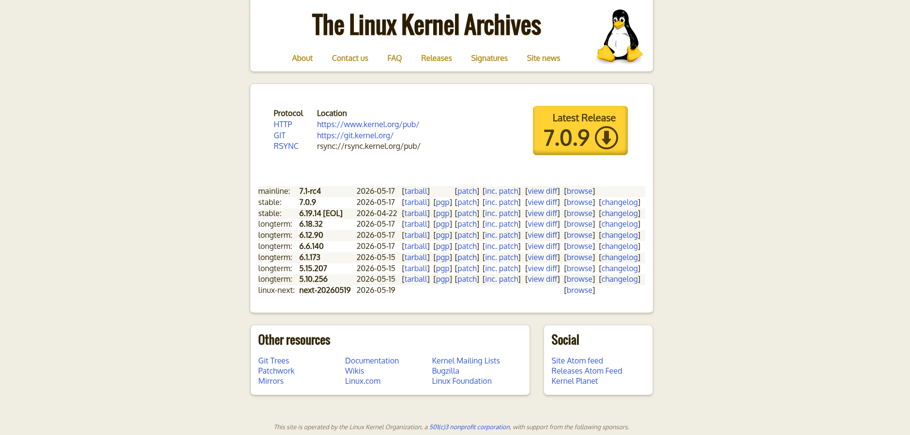
  <figcaption align="center"><i>Strona główna kernel.org z wersją 7.0.9</i></figcaption>
</figure>

---

## 2. Konfiguracja sieciowa - rozwiązywanie problemów

Bezpośrednio po instalacji systemu operacyjnego i próbie aktualizacji pakietów za pomocą `slackpkg` zidentyfikowano problem z brakiem dostępu do internetu wewnątrz maszyny wirtualnej. Klient DHCP (`dhcpcd`) na interfejsie `eth0` nie otrzymywał prawidłowej adresacji IPv4 od usługi `dnsmasq`, otrzymując w zamian adresy z puli APIPA (`169.254.x.x`). Komenda diagnostyczna `ping -c 3 google.com` kończyła się komunikatem o niemożliwości rozwiązania nazwy hosta (`Temporary failure in name resolution`).

Po weryfikacji konfiguracji po stronie systemu nadrzędnego ustalono, że ruch sieciowy na wirtualnym mostku `virbr0` był blokowany przez restrykcyjną politykę zapory UFW (Uncomplicated Firewall). Zapora nie posiadała reguł zezwalających na przepuszczanie pakietów DHCP (port 67 UDP) ani na routing pakietów pomiędzy interfejsem wirtualnym a siecią zewnętrzną.

W celu przywrócenia poprawnej komunikacji sieciowej w systemie nadrzędnym zaaplikowano następujące reguły:

```bash
sudo ufw allow in on virbr0
sudo ufw allow out on virbr0
sudo ufw route allow in on virbr0
sudo ufw route allow out on virbr0
```

Po wykonaniu powyższych instrukcji maszyna wirtualna bezzwłocznie otrzymała poprawne parametry konfiguracyjne z serwera DHCP (adres z puli `192.168.122.0/24`), odzyskując łączność ze światem zewnętrznym.

---

## 3. Kompilacja: Metoda 1 (`localmodconfig`)

Pierwsza z zastosowanych metod optymalizacji polegała na wygenerowaniu konfiguracji na podstawie aktualnie załadowanych modułów w działającym systemie. Jest to podejście pozwalające na zredukowanie czasu kompilacji oraz rozmiaru wynikowego obrazu jądra poprzez eliminację sterowników i podsystemów, które nie są wymagane przez bieżący sprzęt.

### 3.1. Pobranie i rozpakowanie źródeł

Pobrano archiwum z kodem źródłowym jądra ze strony kernel.org i wypakowano je do katalogu `/usr/src`.

```bash
cd /usr/src
wget https://cdn.kernel.org/pub/linux/kernel/v7.x/linux-7.0.9.tar.xz
```
<figure>
  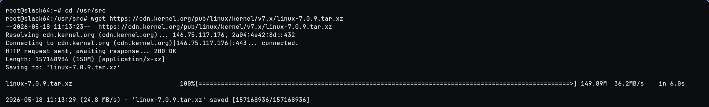
  <figcaption align="center"><i>Pobieranie źródeł jądra</i></figcaption>
</figure>

```bash
tar -xvpf linux-7.0.9.tar.xz
cd linux-7.0.9
```
<figure>
  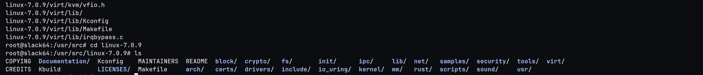
  <figcaption align="center"><i>Rozpakowywanie archiwum ze źródłami</i></figcaption>
</figure>

### 3.2. Przygotowanie bazowej konfiguracji

Jako punkt wyjścia skopiowano konfigurację aktualnie działającego jądra systemowego.

```bash
zcat /proc/config.gz > .config
```
<figure>
  
  <figcaption align="center"><i>Kopiowanie konfiguracji bazowej</i></figcaption>
</figure>

### 3.3. Generowanie zminimalizowanej konfiguracji

Komenda `make localmodconfig` porównuje listę aktualnie załadowanych modułów (uzyskaną z `lsmod`) z istniejącym plikiem `.config` i dezaktywuje wszystkie opcje modułowe, które nie odpowiadają żadnemu załadowanemu sterownikowi. Dla każdego nowego symbolu konfiguracyjnego, którego wartość nie jest określona w bazowym pliku, narzędzie wyświetla interaktywny monit - we wszystkich przypadkach zaakceptowano wartości domyślne.

```bash
make localmodconfig
```
<figure>
  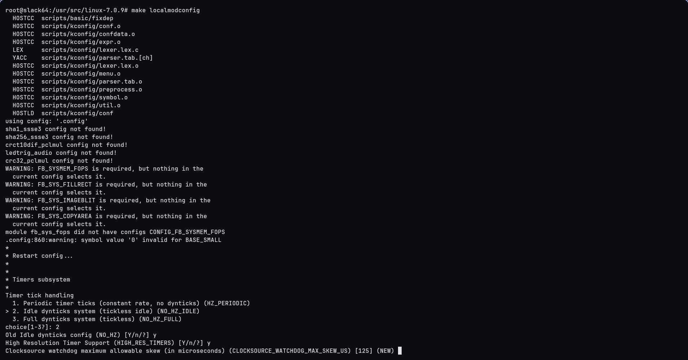
  <figcaption align="center"><i>Przebieg komendy localmodconfig - monity konfiguracyjne</i></figcaption>
</figure>

<figure>
  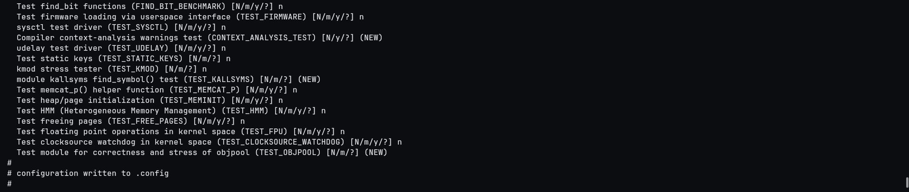
  <figcaption align="center"><i>Zakończenie procesu localmodconfig</i></figcaption>
</figure>

Następnie rozwiązano wszelkie zależności konfiguracyjne:

```bash
make olddefconfig
```
<figure>
  
  <figcaption align="center"><i>Rozwiązywanie zależności konfiguracyjnych</i></figcaption>
</figure>

### 3.4. Kompilacja jądra i modułów

Proces kompilacji uruchomiono z wykorzystaniem wszystkich ośmiu dostępnych rdzeni wirtualnych.

```bash
make -j8 bzImage
```
<figure>
  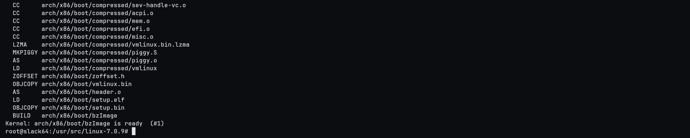
  <figcaption align="center"><i>Kompilacja obrazu jądra</i></figcaption>
</figure>

```bash
make -j8 modules
```
<figure>
  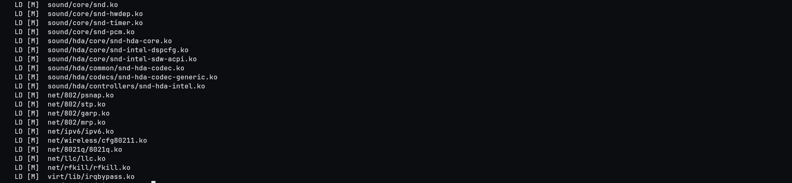
  <figcaption align="center"><i>Kompilacja modułów</i></figcaption>
</figure>

```bash
make -j8 modules_install
```
<figure>
  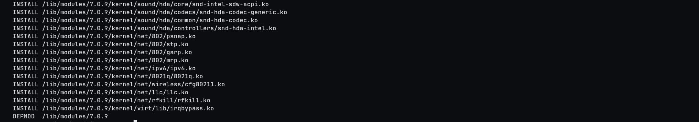
  <figcaption align="center"><i>Instalacja modułów do /lib/modules</i></figcaption>
</figure>

```bash
make -j8 headers_install
```
<figure>
  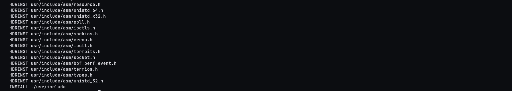
  <figcaption align="center"><i>Instalacja nagłówków jądra</i></figcaption>
</figure>

### 3.5. Instalacja jądra i konfiguracja bootloadera

Skompilowane pliki skopiowano do katalogu `/boot` z przyrostkiem identyfikującym zastosowaną metodę.

```bash
cp arch/x86_64/boot/bzImage /boot/vmlinuz-custom-7.0.9-localmod
cp System.map /boot/System.map-custom-7.0.9-localmod
cp .config /boot/config-custom-7.0.9-localmod
```
<figure>
  
  <figcaption align="center"><i>Kopiowanie artefaktów kompilacji do /boot</i></figcaption>
</figure>

Wygenerowano obraz początkowy ramdysku (`initrd`) przy użyciu narzędzia `mkinitrd`. Parametry komendy uzyskano z wbudowanego generatora:

```bash
/usr/share/mkinitrd/mkinitrd_command_generator.sh -k 7.0.9
mkinitrd -c -k 7.0.9 -f ext4 -r /dev/vda1 -m ext4 -u -o /boot/initrd-custom-7.0.9-localmod.gz
```
<figure>
  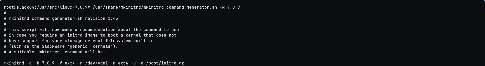
  <figcaption align="center"><i>Przygotowanie komendy mkinitrd</i></figcaption>
</figure>

<figure>
  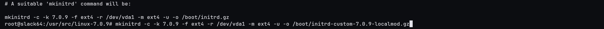
  <figcaption align="center"><i>Modyfikacja ścieżki docelowej</i></figcaption>
</figure>

<figure>
  
  <figcaption align="center"><i>Utworzenie obrazu initrd</i></figcaption>
</figure>

Zaktualizowano konfigurację bootloadera GRUB, aby uwzględniała nowo skompilowane jądro:

```bash
grub-mkconfig -o /boot/grub/grub.cfg
```
<figure>
  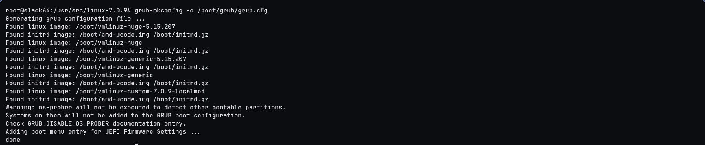
  <figcaption align="center"><i>Regeneracja konfiguracji GRUB</i></figcaption>
</figure>

### 3.6. Weryfikacja

Po ponownym uruchomieniu systemu w menu GRUB pojawiła się nowa pozycja odpowiadająca skompilowanemu jądru.

<figure>
  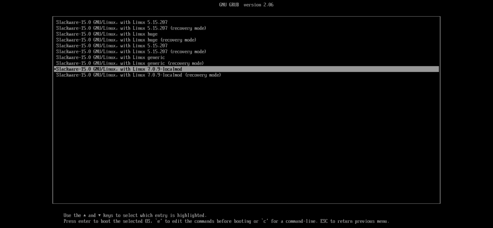
  <figcaption align="center"><i>Menu bootloadera GRUB z nowym jądrem</i></figcaption>
</figure>

```bash
uname -r
```
<figure>
  
  <figcaption align="center"><i>Weryfikacja wersji uruchomionego jądra</i></figcaption>
</figure>

---

## 4. Kompilacja: Metoda 2 (`streamline_config.pl`)

Drugie podejście opierało się na wykorzystaniu skryptu napisanego w języku Perl, dostarczanego w drzewie źródeł jądra (`scripts/kconfig/streamline_config.pl`). Skrypt ten przycina dystrybucyjny plik `.config` na podstawie aktualnie załadowanych modułów sprzętowych (wykrytych przez `lsmod`), analizując przy tym zależności zdefiniowane w plikach `Kconfig` i `Makefile`.

### 4.1. Czyszczenie środowiska kompilacyjnego

Przed przystąpieniem do drugiej metody środowisko kompilacyjne musiało zostać całkowicie zresetowane. Komenda `make mrproper` usuwa zarówno pliki obiektowe, jak i wszelkie pliki konfiguracyjne, przywracając katalog źródłowy do stanu świeżo rozpakowanego archiwum.

```bash
cd /usr/src/linux-7.0.9
make mrproper
```
<figure>
  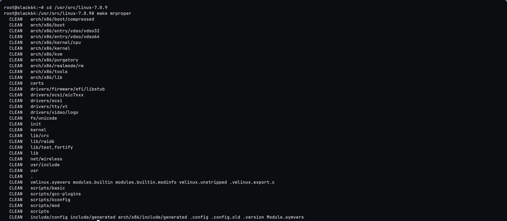
  <figcaption align="center"><i>Czyszczenie katalogu źródeł</i></figcaption>
</figure>

Przywrócono bazowy plik konfiguracyjny z archiwum systemowego:

```bash
zcat /proc/config.gz > .config
```
<figure>
  
  <figcaption align="center"><i>Odzyskiwanie konfiguracji bazowej</i></figcaption>
</figure>

### 4.2. Generowanie konfiguracji skryptem Perl

Skrypt `streamline_config.pl` odczytuje bieżącą listę modułów i generuje zoptymalizowany plik konfiguracyjny:

```bash
perl scripts/kconfig/streamline_config.pl > config_newmethod
mv config_newmethod .config
```
<figure>
  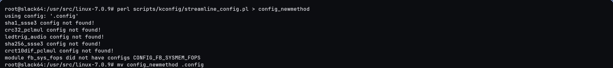
  <figcaption align="center"><i>Wykonanie skryptu streamline_config.pl</i></figcaption>
</figure>

Rozwiązano zależności konfiguracyjne:

```bash
make olddefconfig
```
<figure>
  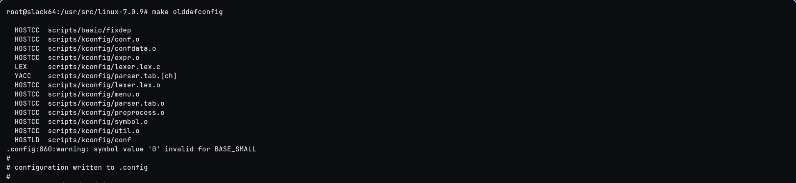
  <figcaption align="center"><i>Rozwiązywanie zależności konfiguracyjnych</i></figcaption>
</figure>

### 4.3. Kompilacja jądra i modułów

Analogicznie do pierwszej metody, kompilację przeprowadzono z wykorzystaniem ośmiu rdzeni wirtualnych.

```bash
make -j8 bzImage
```
<figure>
  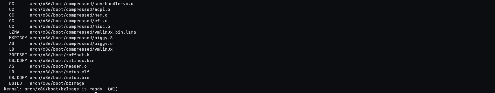
  <figcaption align="center"><i>Kompilacja obrazu jądra</i></figcaption>
</figure>

```bash
make -j8 modules
```
<figure>
  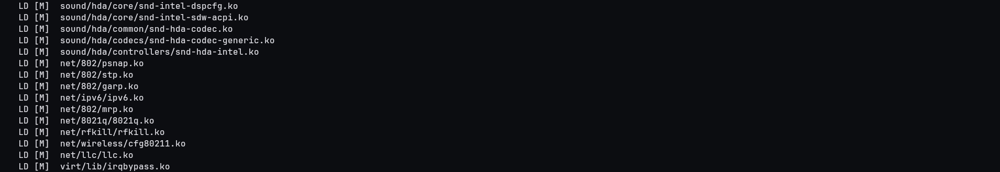
  <figcaption align="center"><i>Kompilacja modułów</i></figcaption>
</figure>

```bash
make -j8 modules_install
```
<figure>
  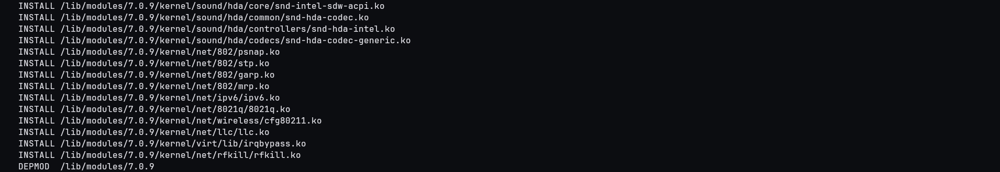
  <figcaption align="center"><i>Instalacja modułów do /lib/modules</i></figcaption>
</figure>

```bash
make -j8 headers_install
```
<figure>
  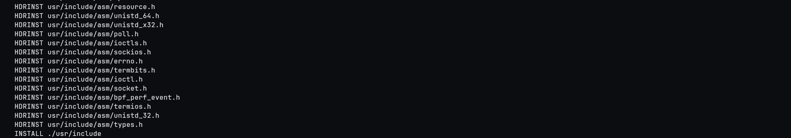
  <figcaption align="center"><i>Instalacja nagłówków jądra</i></figcaption>
</figure>

### 4.4. Instalacja jądra i konfiguracja bootloadera

Artefakty kompilacji skopiowano do katalogu `/boot` z odrębnym przyrostkiem:

```bash
cp arch/x86_64/boot/bzImage /boot/vmlinuz-custom-7.0.9-streamline
cp System.map /boot/System.map-custom-7.0.9-streamline
cp .config /boot/config-custom-7.0.9-streamline
```
<figure>
  
  <figcaption align="center"><i>Kopiowanie artefaktów kompilacji do /boot</i></figcaption>
</figure>

Wygenerowano obraz ramdysku:

```bash
mkinitrd -c -k 7.0.9 -f ext4 -r /dev/vda1 -m ext4 -u -o /boot/initrd-custom-7.0.9-streamline.gz
```
<figure>
  
  <figcaption align="center"><i>Generowanie initrd dla metody 2</i></figcaption>
</figure>

Zaktualizowano konfigurację bootloadera:

```bash
grub-mkconfig -o /boot/grub/grub.cfg
```
<figure>
  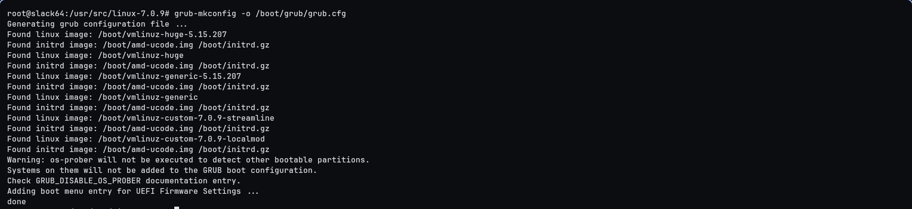
  <figcaption align="center"><i>Regeneracja konfiguracji GRUB</i></figcaption>
</figure>

### 4.5. Weryfikacja

Po ponownym uruchomieniu wybrano jądro skompilowane metodą `streamline_config.pl` z poziomu menu zaawansowanego GRUB.

<figure>
  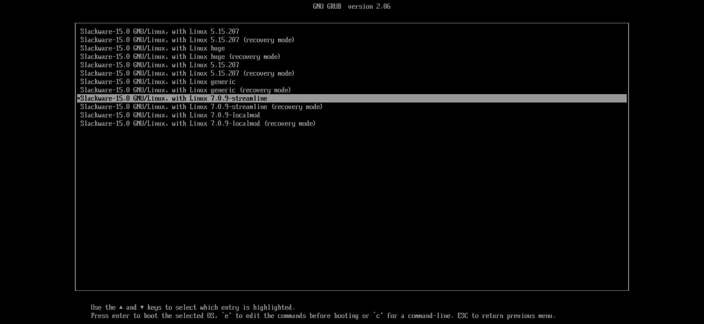
  <figcaption align="center"><i>Menu bootloadera GRUB z oboma jądrami</i></figcaption>
</figure>

<div style="page-break-after: always;"></div>

```bash
uname -r
```
<figure>
  
  <figcaption align="center"><i>Weryfikacja wersji uruchomionego jądra</i></figcaption>
</figure>

---

## 5. Archiwizacja i transfer danych wynikowych

Po zakończeniu obu kompilacji przygotowano archiwum źródłowe zawierające kod jądra wraz z oboma plikami konfiguracyjnymi. Pliki `.config` wygenerowane przez każdą z metod zostały wcześniej zachowane w katalogu `/boot` - skopiowano je z powrotem do drzewa źródeł pod unikalnymi nazwami.

```bash
cp /boot/config-custom-7.0.9-localmod /usr/src/linux-7.0.9/.config.localmod
cp /boot/config-custom-7.0.9-streamline /usr/src/linux-7.0.9/.config.streamline
```
<figure>
  
  <figcaption align="center"><i>Kopiowanie obu konfiguracji do katalogu źródeł</i></figcaption>
</figure>

Usunięto pliki obiektowe powstałe w procesie kompilacji, zachowując kod źródłowy i pliki konfiguracyjne:

```bash
cd /usr/src/linux-7.0.9
make clean
```
<figure>
  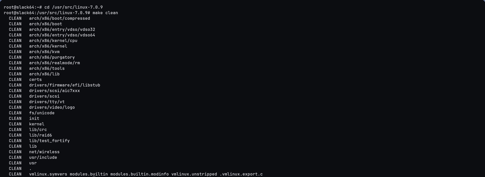
  <figcaption align="center"><i>Czyszczenie plików obiektowych</i></figcaption>
</figure>

Utworzono skompresowane archiwum:

```bash
cd /usr/src
tar -czvf compiled-kernel.tar.gz linux-7.0.9/
```
<figure>
  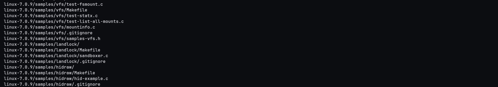
  <figcaption align="center"><i>Tworzenie archiwum tar.gz</i></figcaption>
</figure>

Archiwum przetransferowano na system nadrzędny za pomocą protokołu SFTP:

```bash
sftp root@192.168.122.184
get /usr/src/compiled-kernel.tar.gz
```
<figure>
  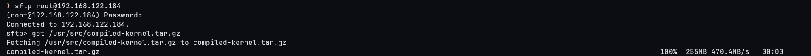
  <figcaption align="center"><i>Transfer archiwum przez SFTP</i></figcaption>
</figure>

---

## 6. Wnioski

Obie zastosowane metody - `make localmodconfig` oraz skrypt `streamline_config.pl` - realizują ten sam cel: redukcję konfiguracji jądra do podzbioru modułów faktycznie wymaganych przez bieżący sprzęt. Różnią się natomiast sposobem działania i zastosowaniem.

**`make localmodconfig`** jest wbudowanym celem systemu budowania jądra (Kbuild). Odczytuje listę załadowanych modułów z `lsmod` i interaktywnie pyta użytkownika o wartości nowych, nieznanych symboli konfiguracyjnych. Ta interaktywność sprawia, że metoda jest intuicyjna w użyciu ręcznym, ale utrudnia jej zastosowanie w zautomatyzowanych potokach CI/CD bez dodatkowych narzędzi (np. `yes "" |`).

**`streamline_config.pl`** operuje na poziomie plików `Kconfig` i `Makefile`, analizując zależności między opcjami konfiguracyjnymi. Wynik działania skryptu jest przekierowywany do pliku, co czyni go w pełni nieinteraktywnym i predestynowanym do użycia w skryptach automatyzujących proces budowania.

Z perspektywy bezpieczeństwa, oba podejścia zmniejszają powierzchnię ataku jądra systemowego. Usunięcie nieużywanych sterowników i podsystemów eliminuje potencjalne wektory ataków w kodzie, który nigdy nie byłby wykorzystywany na danej maszynie. Z perspektywy wydajnościowej, ograniczenie liczby kompilowanych modułów skraca czas kompilacji i zmniejsza rozmiar wynikowego obrazu jądra oraz drzewa modułów w `/lib/modules`.

Sam proces kompilacji w obu przypadkach przebiegł bezproblemowo - nie odnotowano błędów kompilacji, brakujących zależności ani trudności z integracją nowego jądra z bootloaderem GRUB. Czas kompilacji nie był mierzony, ponieważ nie stanowił przedmiotu analizy w ramach tego zadania, a oba przebiegi zakończyły się w rozsądnym czasie na przydzielonych ośmiu rdzeniach wirtualnych.

Gdyby konieczne było wskazanie preferowanej metody, wybór padłby na `streamline_config.pl`. Jej w pełni nieinteraktywny charakter (brak monitów wymagających ręcznej akceptacji) czyni ją znacznie lepiej przystosowaną do wykorzystania w środowiskach zautomatyzowanych, takich jak potoki CI/CD czy skrypty budujące niestandardowe obrazy systemowe.