# Kompilacja pakietu ze źródeł
## System Linux od podszewki
### Kacper Bednarczuk

---

## 1. Wprowadzenie i charakterystyka oprogramowania

Open On-Chip Debugger (OpenOCD) to otwartoźródłowe oprogramowanie służące do debugowania oraz programowania mikrokontrolerów i pamięci flash wbudowanych w układy scalone. Współpracuje z dedykowanymi sprzętowymi adapterami, komunikując się z urządzeniami docelowymi za pomocą standardowych protokołów, takich jak JTAG czy SWD. Narzędzie to stanowi kluczowy element w procesie tworzenia i rozwoju systemów wbudowanych, umożliwiając deweloperom analizę działania kodu uruchomionego bezpośrednio na mikrokontrolerze docelowym.

Kompilację przeprowadzono w kontenerze środowiskowym opartym na dystrybucji Debian Trixie. W ramach dobrych praktyk utrzymywania porządku, stan środowiska izolowanego był na bieżąco zachowywany w formie migawek (`docker commit`).

---

## 2. Przygotowanie zależności i środowiska

Narzędzia i biblioteki deweloperskie (m.in. kompilatory, menedżer `meson`, narzędzie `git`) zainstalowano bezpośrednio z repozytoriów systemowych za pomocą menedżera pakietów `apt`.

```bash
docker pull debian:trixie
docker run -it --name openocd-source debian:trixie bash
```
<figure>
  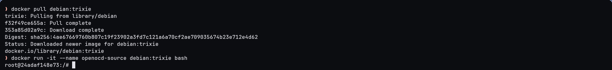
  <figcaption align="center"><i>Uruchomienie kontenera środowiskowego</i></figcaption>
</figure>

```bash
apt update && apt upgrade -y
```
<figure>
  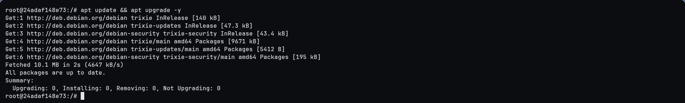
  <figcaption align="center"><i>Aktualizacja indeksów pakietów</i></figcaption>
</figure>

```bash
apt install -y gcc g++ make autoconf automake libtool pkg-config texinfo git wget ca-certificates meson ninja-build
```
<figure>
  
  <figcaption align="center"><i>Rozpoczęcie pobierania podstawowych narzędzi kompilacji</i></figcaption>
</figure>

<figure>
  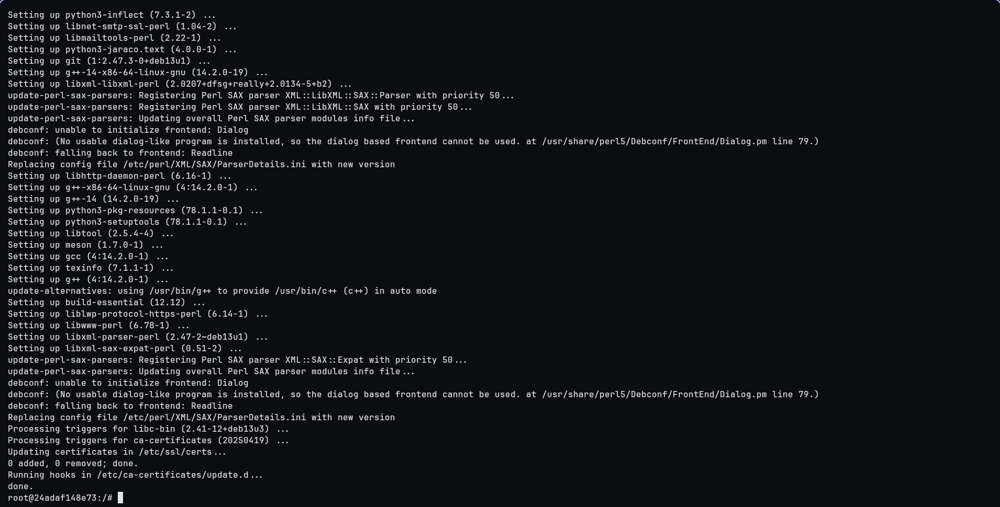
  <figcaption align="center"><i>Instalacja pakietów deweloperskich w środowisku</i></figcaption>
</figure>

```bash
docker commit openocd-source openocd-source:base-system
```
<figure>
  
  <figcaption align="center"><i>Zapisanie punktu przywracania po przygotowaniu środowiska</i></figcaption>
</figure>

Biblioteka `libjaylink`, wykorzystywana do komunikacji z popularnymi adapterami rodziny J-Link, została zbudowana ze źródeł w celach edukacyjnych. Głównym czynnikiem motywującym taki krok była chęć demonstracji oraz empirycznego przećwiczenia systemu budowania Meson, stanowiącego nowoczesną i szybszą alternatywę dla standardowych skryptów z rodziny Autotools, na których bazuje samo OpenOCD.

W pierwszej kolejności sklonowano oficjalne repozytorium projektu i wybrano stabilne wydanie `0.4.0`.

```bash
cd /usr/src
git clone https://gitlab.zapb.de/libjaylink/libjaylink.git
```
<figure>
  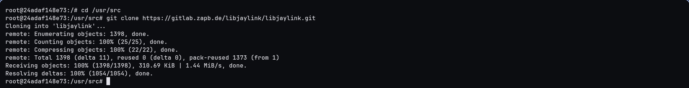
  <figcaption align="center"><i>Klonowanie repozytorium biblioteki libjaylink</i></figcaption>
</figure>

```bash
cd libjaylink
git checkout 0.4.0
```
<figure>
  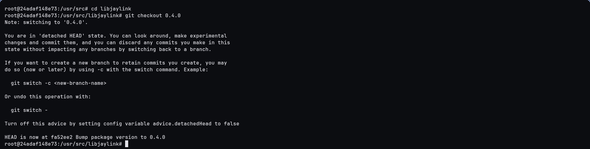
  <figcaption align="center"><i>Zmiana gałęzi na wersję 0.4.0</i></figcaption>
</figure>

Następnie wygenerowano pliki konfiguracyjne systemu budowania oraz zainicjowano kompilację.

```bash
meson setup build
```
<figure>
  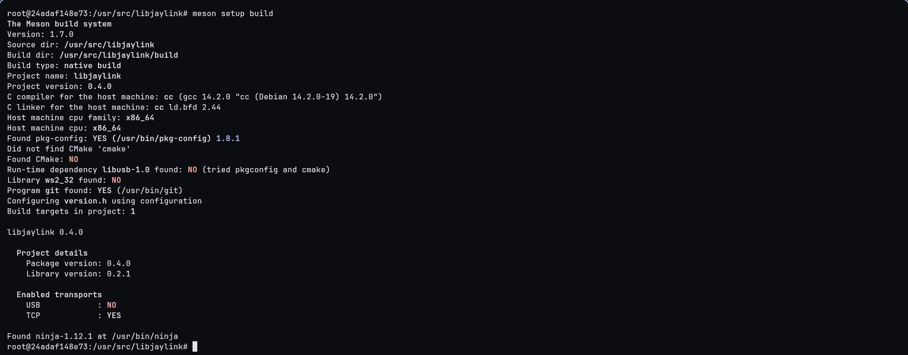
  <figcaption align="center"><i>Konfiguracja procesu budowania</i></figcaption>
</figure>

```bash
meson compile -C build
```
<figure>
  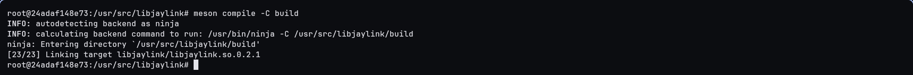
  <figcaption align="center"><i>Kompilacja za pomocą narzędzia Ninja</i></figcaption>
</figure>

Ostatnim etapem prac z pakietem `libjaylink` była instalacja wygenerowanych plików współdzielonych i nagłówkowych do systemu oraz odświeżenie pamięci podręcznej linkera dynamicznego. Całość zakończono ponownym zapisaniem punktu przywracania środowiska.

```bash
meson install -C build
```
<figure>
  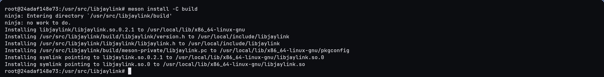
  <figcaption align="center"><i>Rozmieszczenie biblioteki wewnątrz systemu</i></figcaption>
</figure>

```bash
ldconfig
```
<figure>
  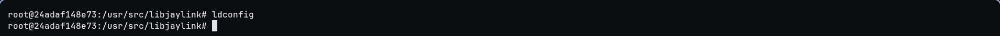
  <figcaption align="center"><i>Odświeżenie bufora bibliotek współdzielonych</i></figcaption>
</figure>

```bash
docker commit openocd-source openocd-source:libjaylink-built
```
<figure>
  
  <figcaption align="center"><i>Zachowanie stanu środowiska po wdrożeniu libjaylink</i></figcaption>
</figure>

Posiadając zestaw narzędzi oraz skompilowaną bibliotekę `libjaylink`, powrócono do menedżera `apt` celem pobrania reszty bibliotek sprzętowych, dostarczających backendy komunikacyjne dla adapterów w OpenOCD.

```bash
apt install -y libjim-dev libusb-1.0-0-dev libftdi1-dev libhidapi-dev libcapstone-dev
```
<figure>
  
  <figcaption align="center"><i>Pobieranie pakietów deweloperskich bibliotek peryferyjnych</i></figcaption>
</figure>

<figure>
  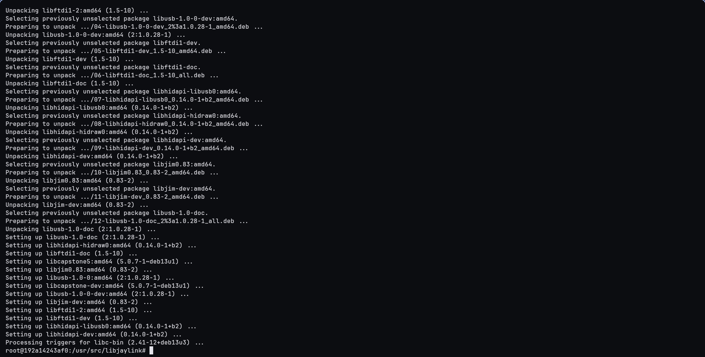
  <figcaption align="center"><i>Pomyślna realizacja procesu pobierania</i></figcaption>
</figure>

```bash
docker commit openocd-source openocd-source:deps-installed
```
<figure>
  
  <figcaption align="center"><i>Zapisanie pełnego środowiska deweloperskiego</i></figcaption>
</figure>

---

## 3. Kompilacja i instalacja OpenOCD

Kod źródłowy aplikacji docelowej pobrano z oficjalnego repozytorium lustrzanego na platformie GitHub. Chociaż głównym miejscem hostowania projektu jest SourceForge, to repozytorium GitHub zostało wybrane z uwagi na wyższą ergonomię i osobiste preferencje względem tej platformy. Następnie przełączono gałąź roboczą na oficjalny tag wydania `v0.12.0`.

```bash
cd /usr/src
git clone https://github.com/openocd-org/openocd/ openocd
```
<figure>
  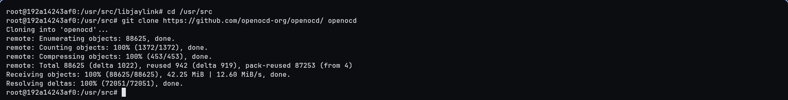
  <figcaption align="center"><i>Pobieranie repozytorium OpenOCD</i></figcaption>
</figure>

```bash
cd openocd
git checkout v0.12.0
```
<figure>
  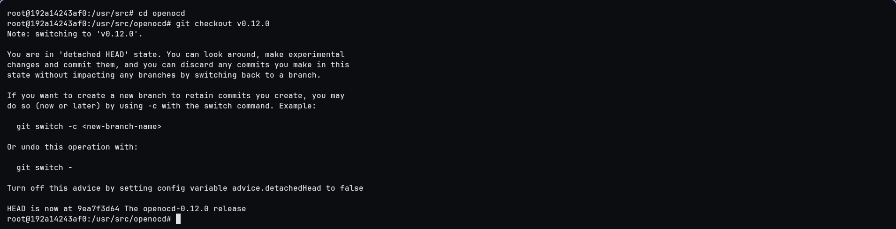
  <figcaption align="center"><i>Wybór stabilnej gałęzi oprogramowania</i></figcaption>
</figure>

System budowania bazujący na pakiecie Autotools wymaga wygenerowania skryptów konfiguracyjnych poleceniem `./bootstrap`.

```bash
./bootstrap
```
<figure>
  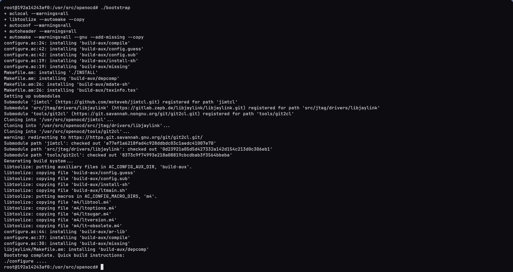
  <figcaption align="center"><i>Generowanie struktury Autotools</i></figcaption>
</figure>

Podczas ustawiania wariantów budowania użyto komendy `./configure`, wskazując jawnie włączenie wielu interfejsów sprzętowych. Z powodu rygorystycznych flag kompilacji stosowanych domyślnie przez projekt OpenOCD (traktowanie ostrzeżeń jako błędów kompilacji) oraz faktu, że kompilator GCC w wersji 14 dostarczany przez system Debian Trixie jest o wiele nowszy niż kod źródłowy OpenOCD z wydania `v0.12.0` i zgłasza dla niego dodatkowe ostrzeżenia, dodano specjalną flagę `--disable-werror`, zabezpieczającą proces przed przerwaniem.

```bash
./configure --enable-dummy --enable-ftdi --enable-usb-blaster --enable-jlink --enable-cmsis-dap --enable-capstone --disable-werror
```
<figure>
  
  <figcaption align="center"><i>Wywołanie konfiguratora z flagami środowiska</i></figcaption>
</figure>

<figure>
  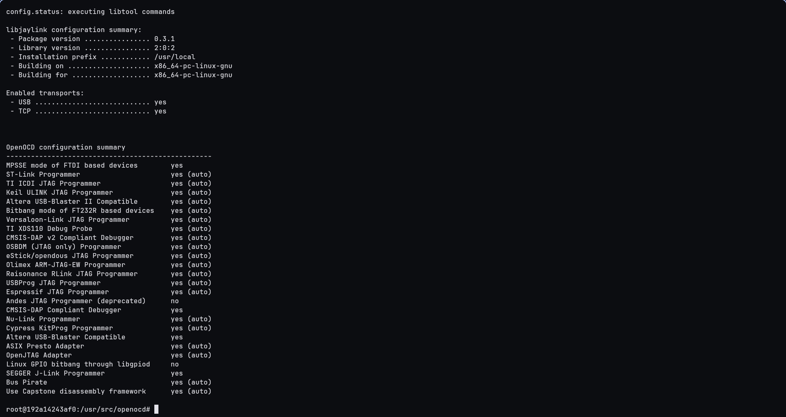
  <figcaption align="center"><i>Tabela podsumowująca aktywowane adaptery</i></figcaption>
</figure>

Właściwa kompilacja programu została uruchomiona komendą `make`.

```bash
make
```
<figure>
  
  <figcaption align="center"><i>Start kompilacji kodów źródłowych</i></figcaption>
</figure>

<figure>
  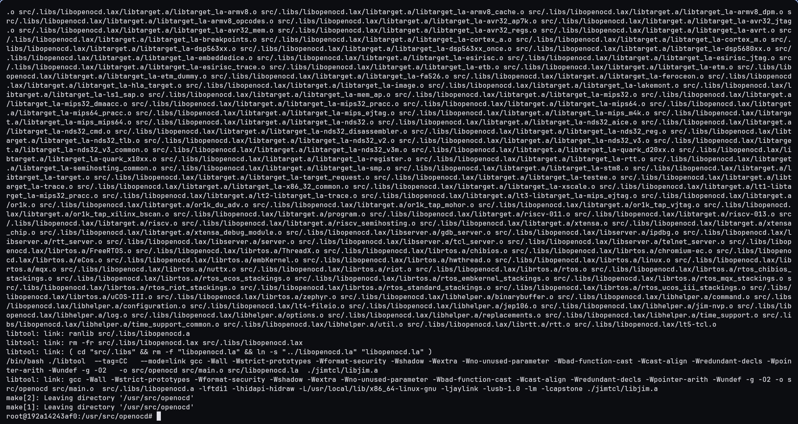
  <figcaption align="center"><i>Wygenerowanie plików binarnych pakietu</i></figcaption>
</figure>

Uruchomiono wewnętrzne polecenie weryfikujące poprawność kodu. Ponieważ pakiet OpenOCD nie zdefiniował własnych testów jednostkowych dla standardowego procesu budowania, cel ten nie wykonał żadnej akcji.

```bash
make check
```
<figure>
  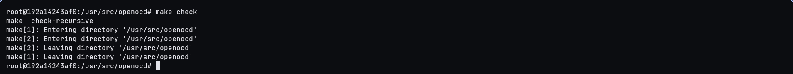
  <figcaption align="center"><i>Próba uruchomienia testów jednostkowych</i></figcaption>
</figure>

Wynikowy plik binarny przekopiowano do odpowiednich folderów systemowych, weryfikując następnie cały przebieg instalacji dodatkowym celem testującym, co podobnie jak we wcześniejszym przypadku, jedynie ukazało brak zdefiniowanych testów poinstalacyjnych dla tego oprogramowania. Zwieńczeniem całego procesu było wykonanie końcowej migawki systemu.

```bash
make install
```
<figure>
  
  <figcaption align="center"><i>Rozpoczęcie procesu instalacji w systemie</i></figcaption>
</figure>

<figure>
  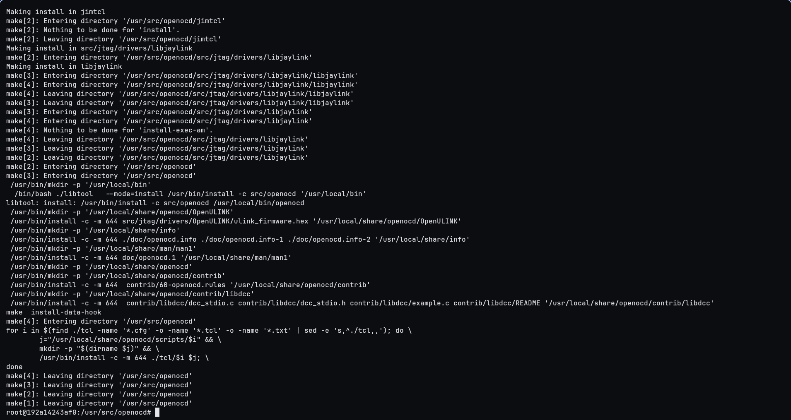
  <figcaption align="center"><i>Rozmieszczenie poleceń w odpowiednich folderach</i></figcaption>
</figure>

```bash
make installcheck
```
<figure>
  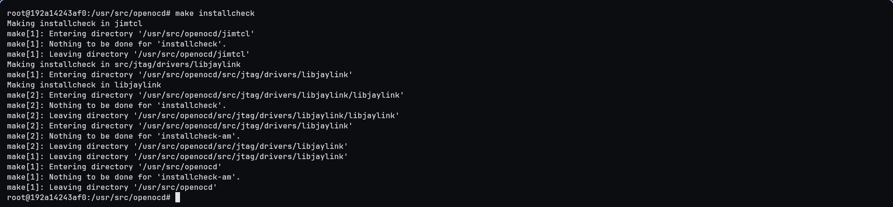
  <figcaption align="center"><i>Próba uruchomienia testów poinstalacyjnych</i></figcaption>
</figure>

```bash
docker commit openocd-source openocd-source:installed
```
<figure>
  
  <figcaption align="center"><i>Ostatnie zanotowanie stanu kontenera</i></figcaption>
</figure>

## 4. Weryfikacja działania i archiwizacja

Kluczowym elementem pracy jest weryfikacja, czy wybrane na etapie konfiguracji opcje zostały pomyślnie zintegrowane wewnątrz docelowej aplikacji binarnej. Wersję programu sprawdzono poleceniem `openocd --version`. Następnie wyświetlono kompletną listę wspieranych adapterów, co potwierdziło poprawną implementację dyrektyw `--enable-*`.

```bash
openocd --version
```
<figure>
  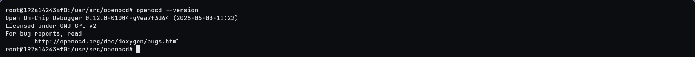
  <figcaption align="center"><i>Weryfikacja widoczności programu w systemie</i></figcaption>
</figure>

```bash
openocd -c "adapter list"
```
<figure>
  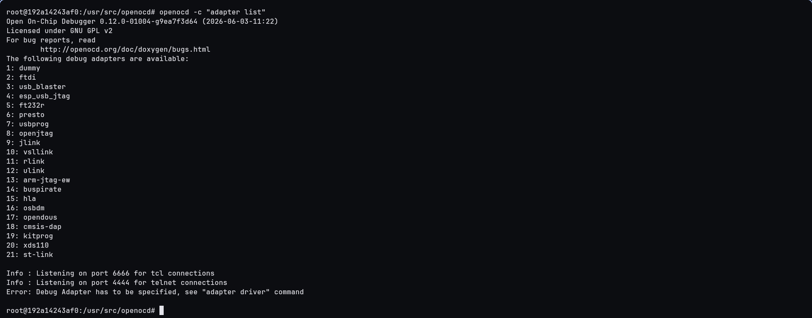
  <figcaption align="center"><i>Prezentacja wbudowanych sprzętowych modułów komunikacji</i></figcaption>
</figure>

Na sam koniec wdrożono odpowiednie standardy organizacyjne dotyczące wydobycia skompilowanych plików oraz kodów źródłowych na system nadrzędny. W przestrzeni kompilacyjnej usunięto przejściowe pliki wynikowe z rozszerzeniem `.o`, które niepotrzebnie zwiększałyby rozmiar archiwum wynikowego.

```bash
cd /usr/src/openocd
make clean
```
<figure>
  
  <figcaption align="center"><i>Uruchomienie procesu optymalizacji struktury</i></figcaption>
</figure>

<figure>
  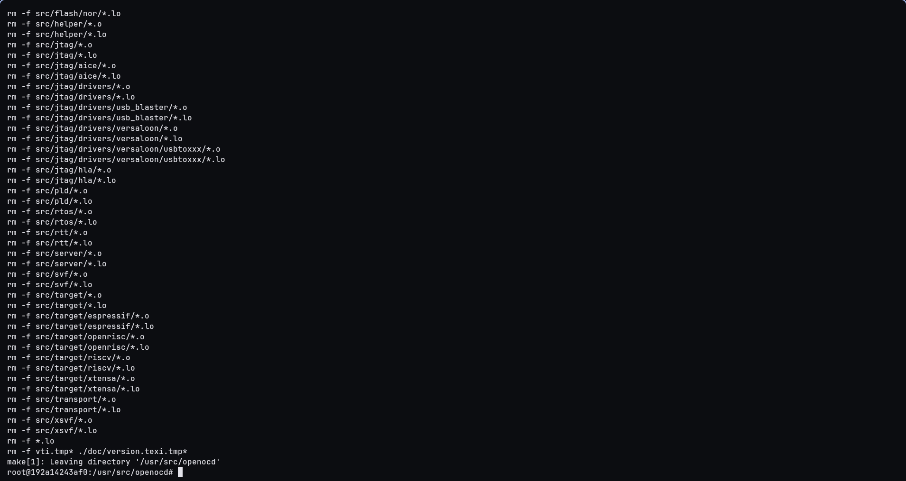
  <figcaption align="center"><i>Skasowanie plików obiektowych kompilatora</i></figcaption>
</figure>

Zminimalizowaną zawartość katalogu źródłowego skompresowano do archiwum w formacie `tar.gz` i wydobyto z izolowanego środowiska wirtualnego do folderu na fizycznej stacji roboczej.

```bash
cd /usr/src
tar -czvf openocd-source.tar.gz openocd/
```
<figure>
  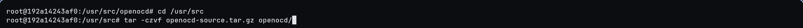
  <figcaption align="center"><i>Rozpoczęcie kompresji kodu źródłowego</i></figcaption>
</figure>

<figure>
  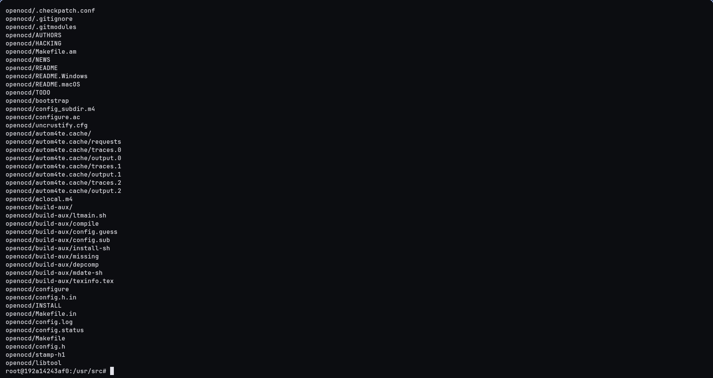
  <figcaption align="center"><i>Utworzenie skompresowanego pliku .tar.gz</i></figcaption>
</figure>

```bash
docker cp openocd-source:/usr/src/openocd-source.tar.gz ~/Documents/
```
<figure>
  
  <figcaption align="center"><i>Pobranie archiwum wynikowego na system nadrzędny</i></figcaption>
</figure>

---

## 5. Wnioski

Proces kompilacji oprogramowania ze źródeł, choć początkowo może wydawać się skomplikowany ze względu na konieczność ręcznego kompletowania zależności, daje ogromną kontrolę nad docelowym kształtem aplikacji. W przypadku OpenOCD, narzędzie to udostępnia dziesiątki adapterów sprzętowych, z których każdy nierzadko wymaga obecności specyficznej biblioteki deweloperskiej w systemie. Zebranie wszystkich pakietów przebiegło jednak sprawnie dzięki menedżerowi `apt`. Na potrzeby ćwiczenia korzystano z konkretnych wersji poszczególnych modułów (`libjaylink` w wersji `0.4.0`) i pakietów oprogramowania (`OpenOCD` w wersji `v0.12.0`), aby umożliwić deterministyczne odtworzenie procesu kompilacji.

Warto przy tym odnotować problem pojawiający się podczas kompilacji starszych wersji programów w nowszych środowiskach. Kod OpenOCD `v0.12.0` (wydany na początku 2023 roku) natrafia na rygorystyczne analizy kompilatora GCC 14 zaimplementowanego w Debianie Trixie, który podnosi status dawnych konstrukcji kodu (m.in. w podmodule `jimtcl`) do poziomu krytycznych ostrzeżeń. Przy domyślnych ustawieniach projektu, rzutowało to na błędy i przerwanie pracy. Użycie flagi `--disable-werror` na etapie konfiguracji było w tym wypadku niezbędnym remedium do pomyślnego sfinalizowania instalacji.

Dodatkową, cenną wartością do ćwiczenia było użycie nowoczesnego systemu Meson na przykładzie mniejszej biblioteki (`libjaylink`), którego szybkość i czytelność składni znacząco przewyższa historyczny proces oparty na pakiecie Autotools. Z kolei brak wbudowanych w OpenOCD testów dla standardowych celów narzędzia Make (`check` oraz `installcheck`) udowadnia, że każdy projekt open-source rozwija się własnym rytmem i implementuje tylko wybraną część utartych standardów.

Podsumowując, ćwiczenie to skutecznie zademonstrowało pełen cykl budowania i wdrażania otwartego oprogramowania w ekosystemie Linux.
