# Budowa pakietu rpm ze źródeł
## System Linux od podszewki
### Kacper Bednarczuk

---

## 1. Wprowadzenie i charakterystyka oprogramowania

Przedmiotem prac opisanych w niniejszym raporcie było skompilowanie i zbudowanie pakietu instalacyjnego rpm dla oprogramowania Open On-Chip Debugger (OpenOCD).

Budowę pakietu przeprowadzono w kontenerze środowiskowym opartym na dystrybucji Fedora. W celu wygenerowania instalatora wykorzystano wbudowane mechanizmy pobierania oficjalnych paczek źródłowych (SRPM), co pozwoliło pominąć ręczną budowę struktury katalogów i samodzielne pisanie pliku konfiguracyjnego `.spec`, znacznie automatyzując pracę.

---

## 2. Przygotowanie zależności i środowiska

Proces rozpoczęto od pobrania obrazu i uruchomienia kontenera środowiskowego. Następnie zaktualizowano indeksy menedżera pakietów, aby przygotować środowisko do pobrania pakietów wymaganych podczas kompilacji.

```bash
docker pull fedora:40
docker run -it --name openocd-rpm fedora:40 bash
```
<figure>
  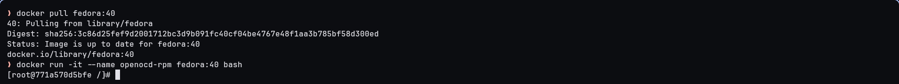
  <figcaption align="center"><i>Uruchomienie kontenera środowiskowego</i></figcaption>
</figure>

```bash
dnf update -y
```

<figure>
  
  <figcaption align="center"><i>Rozpoczęcie pobierania najnowszych pakietów</i></figcaption>
</figure>

<figure>
  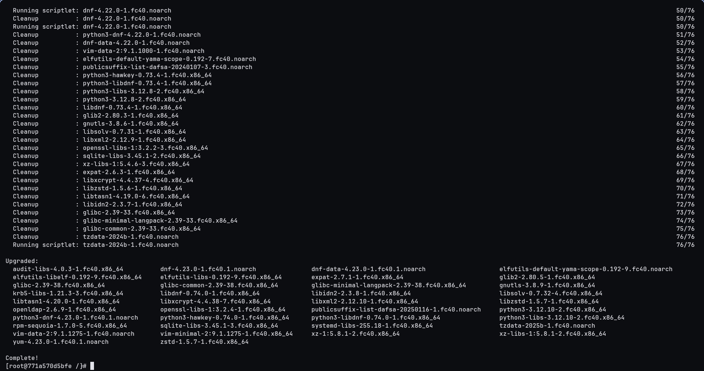
  <figcaption align="center"><i>Zakończenie aktualizacji środowiska</i></figcaption>
</figure>

```bash
dnf install -y rpm-build dnf-plugins-core
```
<figure>
  
  <figcaption align="center"><i>Rozpoczęcie pobierania podstawowych narzędzi kompilacji</i></figcaption>
</figure>

<figure>
  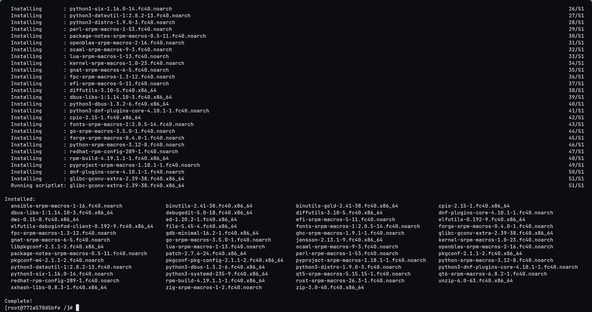
  <figcaption align="center"><i>Instalacja pakietów deweloperskich w środowisku</i></figcaption>
</figure>

---

## 3. Kompilacja i budowa pakietu rpm

W pierwszej kolejności zainstalowano wszystkie biblioteki oraz pakiety deweloperskie niezbędne do przeprowadzenia poprawnej kompilacji oprogramowania. Zamiast manualnie identyfikować każdą zależność, wykorzystano dedykowane narzędzie pobierające kompletne listy wymogów powiązanych bezpośrednio z plikami źródłowymi wybranego programu. Następnie pobrano właściwy kod źródłowy wraz ze skonfigurowaną strukturą RPM.

```bash
mkdir -p /usr/src/openocd-pkg
cd /usr/src/openocd-pkg
dnf builddep -y openocd
```
<figure>
  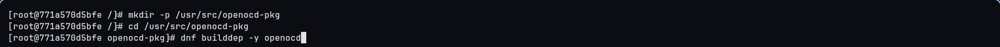
  <figcaption align="center"><i>Instalacja zależności kompilacyjnych</i></figcaption>
</figure>

<figure>
  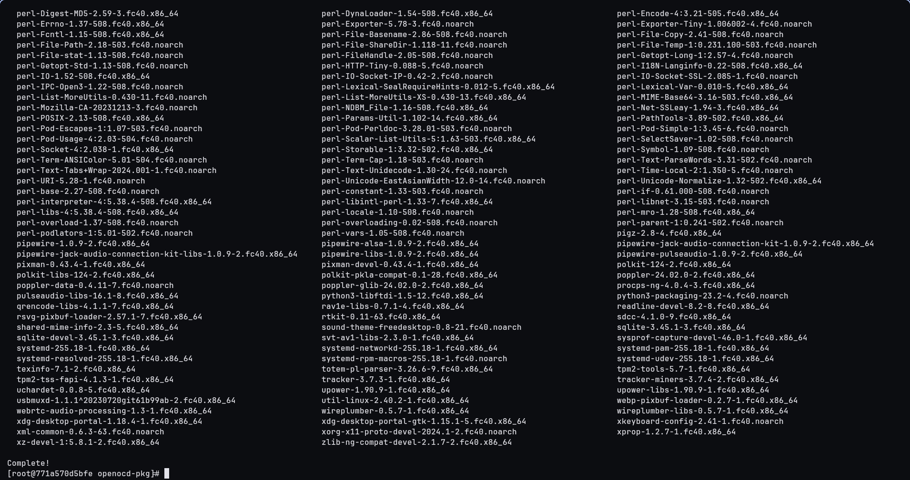
  <figcaption align="center"><i>Zakończenie pobierania zależności kompilacyjnych</i></figcaption>
</figure>

```bash
dnf download --source openocd
rpm -ivh openocd-*.src.rpm
```
<figure>
  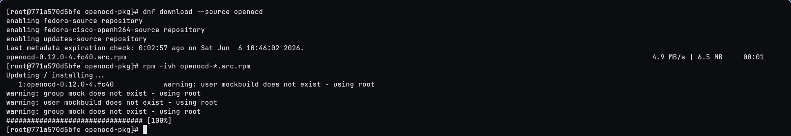
  <figcaption align="center"><i>Pobranie i instalacja paczki z kodami źródłowymi aplikacji</i></figcaption>
</figure>

```bash
cd ~/rpmbuild/SPECS/
rpmbuild -ba --noclean openocd.spec
```
<figure>
  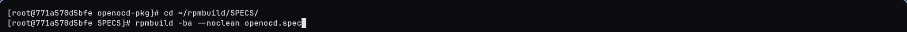
  <figcaption align="center"><i>Rozpoczęcie kompilacji kodu źródłowego</i></figcaption>
</figure>

<figure>
  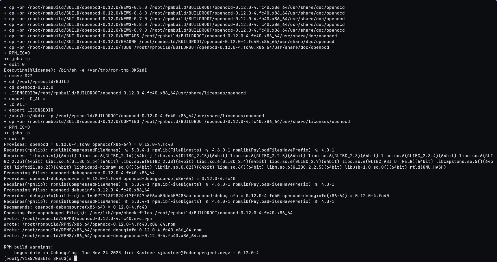
  <figcaption align="center"><i>Wygenerowanie pakietu rpm</i></figcaption>
</figure>

```bash
cd ~/rpmbuild/RPMS/x86_64/
ls *.rpm
```
<figure>
  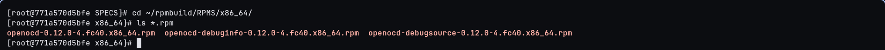
  <figcaption align="center"><i>Potwierdzenie wygenerowania pakietów instalacyjnych</i></figcaption>
</figure>

---

## 4. Weryfikacja działania i archiwizacja

Po zbudowaniu pakietu przetestowano jego działanie, instalując go bezpośrednio w kontenerze. Zweryfikowano również poprawność samej kompilacji, sprawdzając wyświetlaną wersję programu oraz wygenerowaną listę dostępnych adapterów sprzętowych.

```bash
dnf install -y ./*.rpm
```
<figure>
  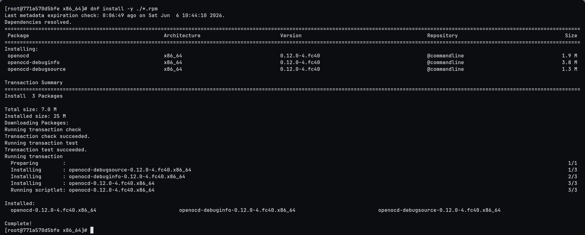
  <figcaption align="center"><i>Instalacja oprogramowania z pakietu rpm</i></figcaption>
</figure>

```bash
openocd --version
```
<figure>
  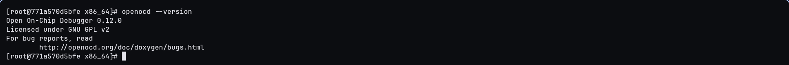
  <figcaption align="center"><i>Weryfikacja widoczności programu w systemie</i></figcaption>
</figure>

```bash
openocd -c "adapter list"
```
<figure>
  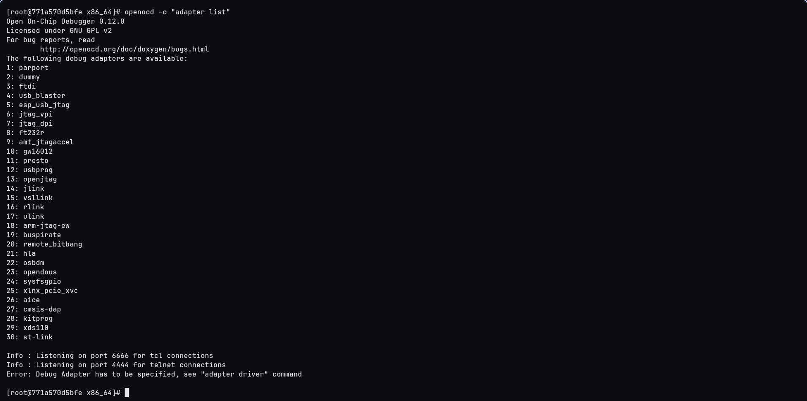
  <figcaption align="center"><i>Prezentacja wbudowanych sprzętowych modułów komunikacji</i></figcaption>
</figure>

Ostatnim etapem prac było spakowanie kodu źródłowego programu do archiwum tar. Z uwagi na użycie flagi `--noclean`, rozpakowane po procesie budowy źródła pozostały w przeznaczonym dla nich katalogu.

```bash
cd ~/rpmbuild/BUILD/
tar -czvf openocd-rpm-source.tar.gz openocd-*/
```
<figure>
  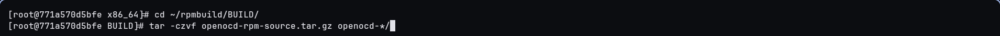
  <figcaption align="center"><i>Rozpoczęcie kompresji kodu źródłowego</i></figcaption>
</figure>

<figure>
  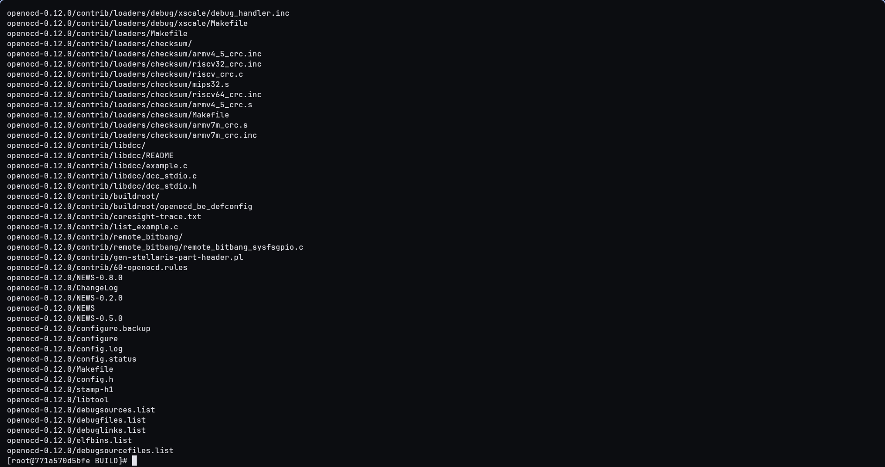
  <figcaption align="center"><i>Utworzenie skompresowanego pliku .tar.gz</i></figcaption>
</figure>

Gotowe pakiety instalacyjne oraz skompresowane źródła przekopiowano następnie z kontenera bezpośrednio do folderu na fizycznej stacji roboczej, używając poleceń dostarczonych w środowisku Docker.

```bash
docker cp openocd-rpm:/root/rpmbuild/RPMS/x86_64/openocd-0.12.0-4.fc40.x86_64.rpm ~/Documents/
```
<figure>
  
  <figcaption align="center"><i>Pobranie pakietu rpm na system nadrzędny</i></figcaption>
</figure>

```bash
docker cp openocd-rpm:/root/rpmbuild/BUILD/openocd-rpm-source.tar.gz ~/Documents/
```
<figure>
  
  <figcaption align="center"><i>Pobranie archiwum wynikowego na system nadrzędny</i></figcaption>
</figure>

---

## 5. Wnioski

Budowanie oprogramowania ze źródeł do ustandaryzowanego formatu rpm to procedura lepsza i bezpieczniejsza niż ręczna kompilacja na maszynie docelowej. Taka konwencja pozwala docelowemu oprogramowaniu na korzystanie z bibliotek zawartych już w systemie operacyjnym, zamiast nakazywać procesowi kompilacji budowę ich lokalnych kopii zintegrowanych z kodem źródłowym aplikacji. Ogranicza to znacząco przestrzeń zajmowaną przez finalny plik instalacyjny i umożliwia natywną aktualizację współdzielonych modułów.

Największym atutem metody pobierania paczek źródłowych jest oparcie całego procesu na zintegrowanych mechanizmach dystrybucji, które skutecznie zdejmują z dewelopera obowiązek pilnowania zależności oraz manualnego tworzenia struktury konfiguracyjnej budowanego pakietu.

Gotowy pakiet rpm zauważalnie ułatwia proces wdrażania narzędzia. Używany menedżer pakietów samodzielnie przeprowadza weryfikację wszystkich wymagań środowiskowych przed rozpoczęciem instalacji w systemie, minimalizując tym samym ryzyko napotkania problemów z niewłaściwą konfiguracją lub brakującymi pakietami współdzielonymi, co może wystąpić podczas konwencjonalnego przenoszenia skompilowanych plików binarnych do systemu docelowego.
